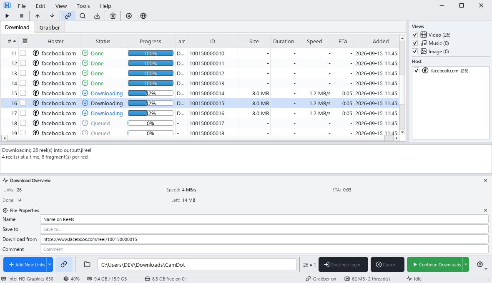

<p align="center">
  
</p>
<h1 align="center">CamDot</h1>
<p align="center">
  A cross-platform download manager for social feeds, channels, and direct links
</p>

<p align="center">
  <a style="text-decoration:none">
    
  </a>
  <a style="text-decoration:none">
    
  </a>
  <a style="text-decoration:none">
    
  </a>
  <a style="text-decoration:none" href="https://github.com/VOK-KH/CamDot/releases">
    
  </a>
</p>

<p align="center">
  <a href="https://github.com/VOK-KH/CamDot">Repository</a> ·
  <a href="https://github.com/VOK-KH/CamDot/releases">Downloads</a> ·
  <a href="https://github.com/VOK-KH/CamDot/issues">Issues</a>
</p>



## Download

Pre-built packages are published on [GitHub Releases](https://github.com/VOK-KH/CamDot/releases).

| Platform | File |
|---|---|
| Windows x86_64 (installer) | `CamDot-v{version}-Windows-x86_64-Setup.exe` |
| Windows x86_64 (portable) | `CamDot-v{version}-Windows-x86_64.exe` |
| Linux / macOS | Coming later |

The app checks for updates on startup and from **Tools → Check for app updates**.

## Features

* **Grabber** and **Download** tabs with optional clipboard monitoring
* Collect feeds and posts, then download in parallel with resume support
* Filter by **Video / Music / Image** and host; package or link properties panel
* Browser login when a site needs an authenticated session
* Optional download speed limit and custom output naming
* System **tray** support — downloads keep running when the window is hidden
* **Supported sites** overview in the app (**Help → Supported sites**)

## Supported sites

| Site | Status |
|---|---|
| Facebook | Supported |
| Instagram | Supported |
| TikTok | Supported |
| YouTube | Supported |
| X (Twitter) | Supported |
| Bilibili | Supported |
| Douyin | Supported |
| Kuaishou | Supported |
| Pinterest | Supported |
| Other HTTPS links | Supported when recognized |
| Threads, Reddit, Snapchat, Xiaohongshu, Weibo, Twitch | Planned |

Some hosts need cookies or a logged-in Chrome session for feeds and private content. Use **Settings → Tools** to paste cookies or a copied cURL command when prompted.

## Quick start (from source)

1. Clone and install with [uv](https://docs.astral.sh/uv/):

    ```shell
    git clone https://github.com/VOK-KH/CamDot.git
    cd CamDot
    uv python install
    uv sync
    ```

2. Launch the GUI:

    ```shell
    uv run camdot
    # or
    uv run camdot-gui
    ```

3. Optional — verify bundled download tools:

    ```shell
    uv run camdot-setup
    ```

### Usage

1. Paste a post, channel, or playlist URL and click **Collect**.
2. Review titles and host icons in the table.
3. Click **Start all Downloads** (or download checked rows only).

**Grabber On** watches the clipboard — copy supported links and they are queued for metadata collection in the background.

### Settings

Open **Settings** from the menu to configure:

* **Output folder** — where finished files are saved
* **Filename template** — how titles are turned into file names
* **Speed limit** — optional cap, e.g. `50K` or `2M`
* **Close to tray** — keep downloads running when the main window closes
* **Tools** — cookies, cURL, Chrome profile, and site-specific options

### Data locations

Default download folder:

* Windows / Linux: `Downloads/CamDot/<channel>/`
* macOS: `Documents/CamDot/<channel>/`

App data (Chrome profile, lists, caches):

* Windows: `%LOCALAPPDATA%\camdot`
* Linux / macOS: `~/.cache/camdot`

## Build from source

Build a standalone app for the current platform:

```shell
uv sync --group dev
uv run python tools/deploy.py
```

Output lands in `dist/` using the same naming as release assets above.

Optional PyArmor obfuscation before packaging:

```shell
PYARMOR=1 uv run python tools/deploy.py
```

## Release

CI builds run on GitHub Actions. To publish a new version:

1. Bump `version` in `pyproject.toml` and `app/__init__.py`
2. Commit, tag, and push:

    ```shell
    git tag v0.2.1
    git push origin v0.2.1
    ```

3. The **Release** workflow builds all platforms and uploads assets to [GitHub Releases](https://github.com/VOK-KH/CamDot/releases).

## Tests

```shell
uv run python -m unittest discover -s tests -v
```

GUI layout preview (offscreen):

```shell
uv run python tools/preview.py preview.png
```

## See also

- [PySide6](https://doc.qt.io/qtforpython/) — Qt for Python GUI toolkit
- [uv](https://docs.astral.sh/uv/) — fast Python package manager

## License

CamDot is licensed under [MIT](LICENSE).

Copyright © 2025–2026 VOK-KH.
