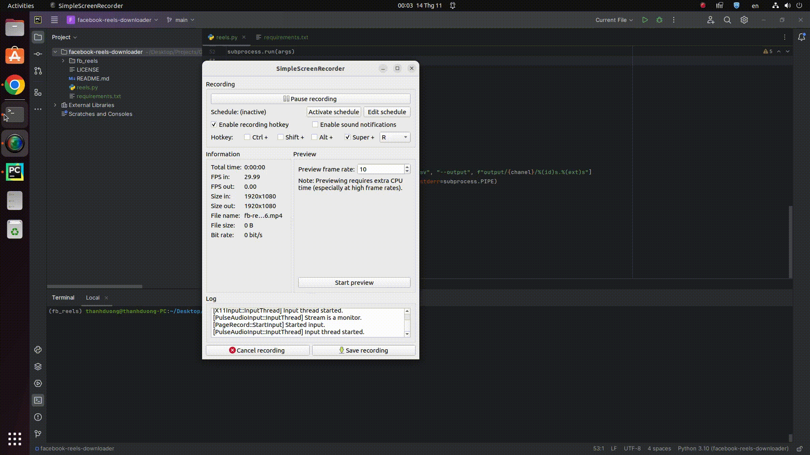

# facebook-reels-downloader
Download all reels on channel with a single command.


Facebook Reels Downloader is simple script written with Python that let you download and save your favorite Facebook reels to your computer in HD(High Defination) quality or in SD(Standard Defination) quality.

Depending upon the available quality of the video, downloader extracts HD quality and SD quality video links. You can choose to download whichever you want. However, in some cases, the only quality available is SD.

All the videos will be in MPEG-4 Part 14 (MP4 😉) format.



## Clone & Configure
```
# clone the repo
$ git clone https://github.com/duongxthanh/facebook-reels-downloader.git

# change the working directory to facebook-reels-downloader
$ cd facebook-reels-downloader

# install Python (if needed) and project dependencies with uv
$ uv python install
$ uv sync
```
> [uv](https://docs.astral.sh/uv/) creates a project virtualenv and installs
> `selenium`, `yt-dlp`, and `PySide6` from `pyproject.toml`. Chromedriver is
> downloaded automatically by Selenium Manager (selenium >= 4.6), so you do
> **not** need to install chromedriver manually.
>
> `imageio-ffmpeg` supplies FFmpeg for Windows, macOS, and Linux. You do not
> need to install FFmpeg separately.

To install or update everything explicitly:
```
uv sync
uv run reels-setup
```
The app checks for yt-dlp and FFmpeg updates once per day in a background
thread. Disable it under **Settings → General**. Updates apply on the next
launch and do not delay startup.

## Usage

### GUI (default)
```
uv run reels
uv run reels-gui
```
The window is a single table: one row per item with host icon, status, progress,
title, size, speed and ETA. Files are named from the caption (or title), with
the id in brackets so names stay unique. Downloading is two steps:

1. Paste a post, channel, or playlist URL and click **Collect**. Titles and
   host icons fill in as metadata is read. Facebook **page /reels** lists still
   open Chrome so you can log in, then click **Continue login**. Instagram
   profiles and X timelines are not supported — paste individual posts.
2. Review the list and click **Start all Downloads**. If any rows are checked,
   only those download — its arrow menu offers **Start all downloads**,
   **Start checked only** and **Cancel job**. Finished rows are skipped; the
   button reads **Continue Downloads** when some
   items are already done so the rest can resume, including leftover `.part`
   files. The table is saved in the output folder and restored the next time
   you open that source. **Settings → Tools → Cookies from browser** is used for
   private or age-gated posts (Chrome, Edge, Firefox, or Brave).

A YouTube link that carries both a video and a list
(`watch?v=…&list=…`, including autoplay mixes) asks whether to collect **This
video** or the **Whole playlist**. The Link Grabber never interrupts with a
question: it takes the single video, so paste the link and press **Collect**
when you want the list.

TikTok sometimes blocks profile pages ("Unable to extract secondary user ID").
Collect any single video from that creator once: the app stores their creator
id and every later collection of the profile is listed through it. You can also
paste `tiktokuser:<sec_uid>` as the source.

**Grabber On** watches clipboard changes like JDownloader's LinkGrabber.
Copy one or several supported links from Facebook, Instagram, TikTok, YouTube,
or X and they are queued for metadata collection in a background thread.
Results merge into the table without duplicates; downloads never start
automatically. Toggle the bottom-bar button or change it in
**Settings → General**.

While a background run syncs, a **Parse Clipboard** monitor floats over the
window's bottom-right corner, like JDownloader's. It reads Duration, Found
Link(s), Duplicate(s), Link queue (copied links still waiting), Grabber list
(rows synced into the Grabber table), Download queue (rows in the Download
table) and Status, and it keeps its own clock so the duration ticks between
links. **Abort** stops the run and drops the queue; the **×** hides the monitor
and the **pin** keeps the finished numbers on screen instead of letting it close
itself a couple of seconds after the run. It reopens on the next run, or from
**Tools → Show grabber monitor**. The monitor stays anchored to the corner as
the window resizes.

### Overview
Above the bottom tools sits an Overview strip that reads the tab you are on,
like JDownloader's. On **Download** it is **Download Overview** — Link(s), Done,
Total Bytes, Downloadspeed, Bytes loaded, Remaining Bytes, ETA, Failed, Running
Downloads and Hoster(s). On **Grabber** it is **Grabber Overview** — Link(s),
Checked, Total Bytes, Known Size, Hoster(s) and Unknown Size, because nothing
is downloading yet. The numbers follow the same 1.5 s poll as the status strip.
Close it with the **×** on its title line or **View → Show overview**
(Ctrl+Shift+O); hiding both it and the status bar stops the polling.

### Bottom tools
The strip under the list follows JDownloader's: **Add New Links** on the left
(its arrow menu also pastes the clipboard or opens the download folder), the
clipboard-watch toggle beside it, then the filter — a field picker (**All
fields**, Title, ID, Uploader, Host, URL) and a search box that narrows both
the Download and Grabber tables at once. The job buttons sit on the right,
ending with **Start all Downloads**. Hide the whole strip with
**View → Show bottom tools** (Ctrl+Shift+B).

**Add New Links** opens a paste box that takes **one link per line**, so a whole
batch goes in at once. A single link still asks the playlist question and
extracts right away; several links are analysed one after another in the
background, with the grabber monitor reporting progress even when the
clipboard watcher is off. Lines that hold no supported link are skipped and
counted in the log.

The app starts in dark mode; **View → Dark theme** (Ctrl+T) switches to light
and the choice is remembered.

### Window frame
There is no native title bar: the menu strip carries the logo and the
minimise/maximise/close buttons, and dragging its empty part moves the window
(double-click maximises). Every panel reaches the window edge, and the
outermost few pixels are the resize border — the pointer turns into a resize
cursor there, exactly as a native frame would.

The output name is derived from the page URL. Override it in
**Settings → General**, which also contains the output folder, concurrency,
theme, and log options. By default files go to
`Downloads/Reels Downloader/<name>/` on Windows and Linux, and
`Documents/Reels Downloader/<name>/` on macOS. **Settings → Tools** can override Chrome (Facebook
reels collection only) and FFmpeg, and can read cookies from your installed
browser. Leave Chrome/FFmpeg blank to use automatic discovery and bundled
FFmpeg.

Click a column header to sort, drag a header to reorder columns, or right-click
the header for the column menu: tick the columns you want (**Uploader**, **File**
and **URL** start hidden), **Fit columns to content**, **Reset columns**, or
**Lock column layout** to freeze widths and order. Drag across
rows to select a range, or tick the checkbox to pick which reels to download.
Right-click for copy, open, and **Remove from list**. The trash button and Delete
drop the selected (or checked) rows; they are not deleted from Facebook. The
source, speed settings, theme, window size and column layout are remembered
between runs.

### Menu bar
The window header carries the app icon and five menus, so every action has a
named home next to its shortcut:

- **File** — Collect, Download, Cancel job, Open download folder, Settings, Exit.
- **Edit** — Select all, Invert checks, Copy URL, Copy caption, Open in browser,
  Remove selected, Remove all.
- **View** — Show log, Show status bar, Show overview, Show bottom tools, Dark
  theme, Lock column layout, Reset columns.
- **Tools** — Link Grabber, Show grabber monitor, Check for tool updates (yt-dlp
  and FFmpeg), Open app data folder.
- **Help** — Supported sites, About (shows the tool versions and download folder).

| Shortcut | Action |
|---|---|
| F5 | Collect from the URL again |
| Ctrl+, | Settings |
| Ctrl+D | Download |
| Ctrl+A | Check and select all visible rows |
| Delete | Remove selected (or checked) rows from the list |
| Ctrl+L | Show/hide the log |
| Ctrl+B | Show/hide the status bar |
| Ctrl+Shift+O | Show/hide the overview |
| Ctrl+Shift+B | Show/hide the bottom tools |
| Ctrl+T | Switch between the dark and light theme |
| Ctrl+G | Turn the clipboard Link Grabber on or off |
| Ctrl+Q | Quit |
| Esc | Cancel the running job |

### Speed: two levels of parallelism
| Setting | What it does | Default |
|---|---|---|
| Parallel | items downloaded at the same time | 4 |
| Fragments | fragments fetched in parallel per item (yt-dlp `-N`) | 8 |

Reels already finished are recorded in `<output>/<channel>/.downloaded.txt` and
skipped instantly on the next run, so an interrupted batch resumes cheaply.
Raise **Parallel** on a fast connection; lower it if Facebook starts throttling.

### Command line
```
# 1) Collect reels from a channel and download them
#    ALWAYS put the URL in quotes (Facebook URLs contain "&").
uv run reels <channel_name> "<channel_reel_url>"

# 2) Re-download later from the saved list (skips scraping)
uv run reels <channel_name> --from-csv output/<channel_name>.csv

# 3) Interactive prompts in the terminal (no GUI)
uv run reels --cli

# 4) Same speed knobs as the GUI, in any mode
uv run reels <channel_name> --from-csv output/<channel_name>.csv --workers 6 --fragments 16
```

You can also run the module directly:
```
uv run python -m app <channel_name> "<channel_reel_url>"
```

### Quote the URL
A Facebook channel link usually looks like
`https://www.facebook.com/profile.php?id=61554746552594&sk=reels_tab`. The `&` is
a **shell operator**, so an unquoted URL never reaches the script:

| Shell | What happens without quotes |
|---|---|
| PowerShell | refuses to run: *"The ampersand (&) character is not allowed"* |
| cmd.exe | silently cuts the URL at the `&` and tries to run the rest as a command |
| bash / zsh | cuts the URL and puts the command in the background |

Quotes fix all three:
```
uv run reels jireel "https://www.facebook.com/profile.php?id=61554746552594&sk=reels_tab"
uv run reels jireel "https://www.facebook.com/jireel/reels"
```
If a cut-off URL still gets through, the script now detects it, warns you, and
puts the reels tab back before scraping.

### What happens when it runs
**Collect** reads metadata first (title, uploader, duration, host) and fills the
table. YouTube channels and TikTok profiles are listed with yt-dlp. A Facebook
**/reels** page still opens Chrome so you can log in, then click **Continue
login**. URLs are saved to `output/<name>.csv` and videos to `output/<name>/`,
named from each post's caption or title. Use **Cookies from browser** in
Settings when a site asks you to log in.

## Troubleshooting
- **`uv: command not found`** — install uv from https://docs.astral.sh/uv/getting-started/installation/ then run `uv sync` in this folder.
- **`ModuleNotFoundError: No module named 'selenium'`** — dependencies were not installed into this project. From the repo root run `uv sync`, then always start the app with `uv run reels` (that uses the project environment).
- **`[WinError 2] The system cannot find the file specified`** after
  *"Reached the bottom of the page."* — this was caused by `yt-dlp` not being on
  PATH. Fixed: the script now calls yt-dlp via `python -m yt_dlp`. Pull the latest
  version.
- **Only the first page of reels is downloaded** — you were not logged in.
  Log in when the Chrome window opens, then continue in the GUI or press Enter
  in the terminal.
- **It freezes during download** — fixed. `yt-dlp` output no longer fills a pipe
  that was never read. Pull the latest version. Broken/removed reels are now
  skipped automatically (`-i`).
- **Downloads fail or stall when many run at once** — Facebook is rate-limiting
  you. Lower **Parallel** (or `--workers`) to 2 and try again; finished reels are
  kept, so the retry only fetches what is missing.
- **`The ampersand (&) character is not allowed`** (PowerShell), or the URL gets
  cut at the `&` (cmd.exe, bash) — the URL was not quoted. Use
  `uv run reels <channel> "<url>"`, or run `uv run reels` with no arguments
  and paste the URL at the prompt.
- **`... is not recognized as the name of a cmdlet`** — the `uv run reels <channel>`
  part is missing from the command; you ran the bare URL.
- **`Not a Facebook URL` / unsupported site** — paste a Facebook, Instagram,
  TikTok, YouTube, or X URL. Instagram profiles and X timelines cannot be listed.

## For your Attention
If you are downloading copyrighted content you should respect author's rights and use the content either for personal purposes or for non-commercial needs with proper mention and authorisation from the author.

## Tests
```
uv run python -m unittest discover -s tests -v
```
Plain `unittest`, no extra dependencies: URL handling, the download helpers, the
table model and filters, and an offscreen smoke test of the window. To review the
layout without opening it:
```
uv run python tools/preview.py preview.png [--dark]
```

### Icons
The toolbar, buttons and row statuses use the SVG set in `images/icons/`. They
are stroked with `currentColor`, and `app/core/icons.py` recolors them for whichever
theme is active. To change or add one, edit the paths in `tools/make_icons.py`
and regenerate:
```
uv run python tools/make_icons.py
```

## Support & Contributions
- Please ⭐️ this repository if this project helped you!
- Contributions of any kind welcome!
